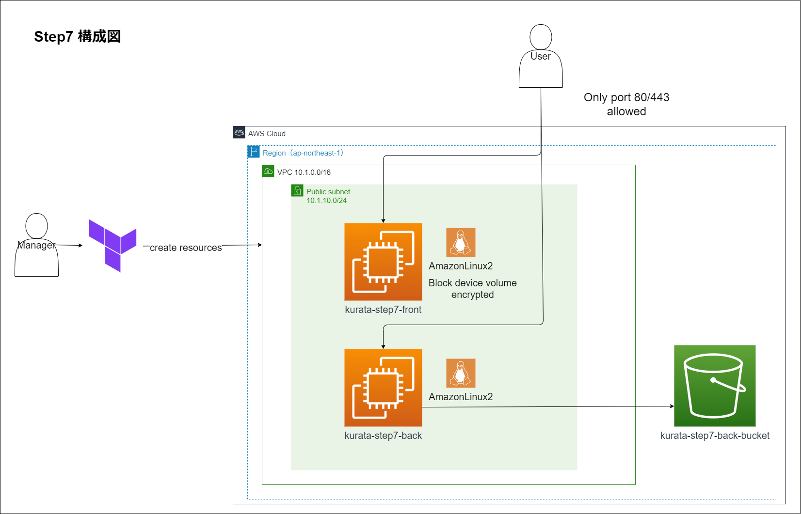

# kurata_terraform

## TOC
- [TOC](#toc)
- [概要](#概要)
- [実行環境](#実行環境)
- [step7構成図](#step7構成図)

## 概要
- 本 [terraform-practice](https://github.com/cnc4e/terraform-practice) の演習問題に取り組んだ実績を残したリポジトリである。
- 各`step<n>`のディレクトリに、それぞれ定義したtfファイルや、修正の流れを記したmdファイルを置いている。
  - `step7`のみ、`terraform apply`後のコンソール画面を記録したmdファイルである。

## 実行環境
- OS：`Windows11 home`
- terraform バージョン：`1.8.2`
- aws バージョン：`5.57.0`

## step7構成図

