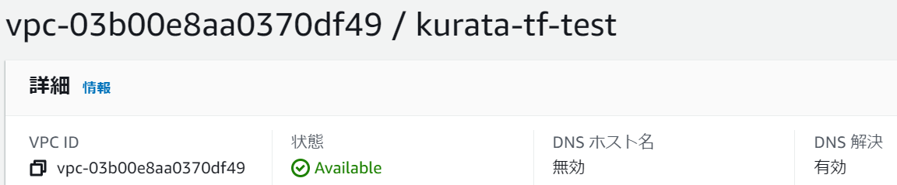

# Terraformのインストールから、簡単なデプロイ、リソース削除まで

## Terraformのインストール
1. <https://developer.hashicorp.com/terraform/downloads>からダウンロード、インストール。詳細は割愛。

1. インストールを確認
```
PS C:\Users\kazu_\Repo\terraform-practice> terraform version
Terraform v1.6.1
```

## AWS CLIのインストール
1. <https://docs.aws.amazon.com/cli/latest/userguide/getting-started-install.html>を参考に、インストール。詳細は割愛。

1. インストールを確認
	```
	PS C:\Users\kazu_\Repo\kurata_terraform> aws --version
	aws-cli/2.13.26 Python/3.11.6 Windows/10 exe/AMD64 prompt/off
	```

## AWS CLIの設定
1. configファイルを以下のように設定
	1. ロールには、`S3ReadOnlyAccess`と`VPCFullAccess`、`IAMFullAccess`権限のみ付与
		```
		PS C:\Users\kazu_> cat .\.aws\config
		[default]
		region = ap-northeast-1

		[profile Kazu_IAMuser]
		region = ap-northeast-1
		mfa_serial = arn:aws:iam::468415095331:mfa/Kazu_IAMuser
		role_arn = arn:aws:iam::468415095331:role/aws_mfa_sts_assumerole
		source_profile = default
		output = json
		```

1. 以下のコマンドで設定値を確認
	``` bash
	aws configure list --profile Kazu_IAMuser
	```

## AWS Vaultの設定
- MFA認証を設定している場合、AWS Vaultを使用して認証すると、セキュアなterraform実行が可能

1. `aws-vault`のインストール
	1. <https://github.com/99designs/aws-vault#installing>

1. `default`プロファイルに、アクセスキーとシークレットアクセスキーを追加
	```
	PS C:\Users\kazu_\Repo\kurata_terraform\step1> aws-vault add default
	Enter Access Key ID: "アクセスキー"
	Enter Secret Access Key: ****************************************
	Added credentials to profile "default" in vault
	```

1. `default`の`credentials`に`default`と表示されていることを確認
	```
	PS C:\Users\kazu_\Repo\kurata_terraform\step1> aws-vault list
	Profile                  Credentials              Sessions
	=======                  ===========              ========
	default                  default                  -
	Kazu_IAMuser             -                        -
	```

## .tfファイルの作成
1. test.tfファイルを参考に、`step1/vpc_northeast.tf`ファイルを作成
	1. AWS Providerのバージョン、VPC名、タグ名を変更

## Terraform実行ディレクトリの初期化
1. ディレクトリを移動
	```
	PS C:\Users\kazu_\Repo\kurata_terraform> cd .\step1\
	```

	```
	PS C:\Users\kazu_\Repo\kurata_terraform\step1> pwd

	Path
	----
	C:\Users\kazu_\Repo\kurata_terraform\step1
	```

1. 以下のコマンドを実行
	``` bash
	aws-vault exec Kazu_IAMuser -- terraform init
	```

## デプロイされるリソースの内容を確認
1. 以下のコマンドを実行
	``` bash
	aws-vault exec Kazu_IAMuser -- terraform plan
	```

## リソースのデプロイ
1. 以下のコマンドを実行
	``` bash
	aws-vault exec Kazu_IAMuser -- terraform apply
	```

1. 以下の表示がされていればよい
	```
	Apply complete! Resources: 1 added, 0 changed, 0 destroyed.
	```

## VPCが作成されていることの確認
### コンソールから


### コマンドから
1. 以下のコマンドを実行
	``` bash
	aws-vault exec Kazu_IAMuser -- aws ec2 describe-vpcs --filters "Name=tag-value,Values=kurata-tf-test"
	```

1. json形式で、作成されたVPCリソースの情報が返ってくる

## リソースの削除
1. 以下のコマンドを実行
	``` bash
	aws-vault exec Kazu_IAMuser -- terraform destroy
	```

1. 以下の表示がされていればよい
	```
	Destroy complete! Resources: 1 destroyed.
	```

## VPCが削除されていることの確認
### コマンドで確認（コンソール確認は割愛）
1. 以下のコマンドを実行
	``` bash
	aws-vault exec Kazu_IAMuser -- aws ec2 describe-vpcs --filters "Name=tag-value,Values=kurata-tf-test"
	```

1. 以下のように中身がないことを確認する
	```
	{
    	"Vpcs": []
	}
	```
