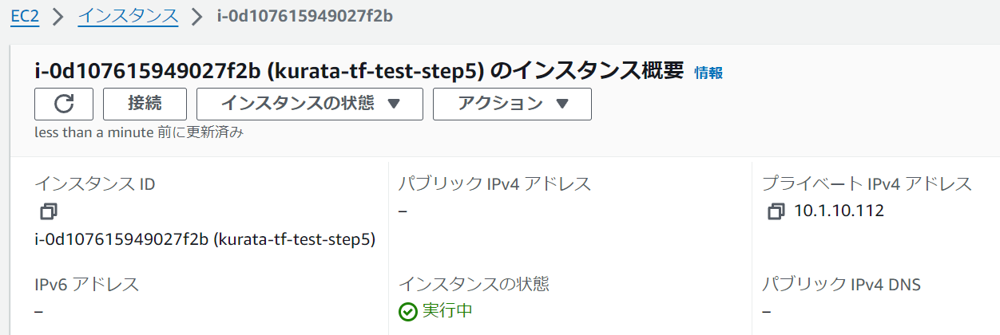

# 基本的なTerraformの書き方・リソース削除

## Terraform実行ディレクトリ作成
1. ディレクトリを移動
	```
	PS C:\Users\kazu_\Repo\kurata_terraform> cd .\step5\
	```

	```
	PS C:\Users\kazu_\Repo\kurata_terraform\step5> pwd

	Path
	----
	C:\Users\kazu_\Repo\kurata_terraform\step5
	```

## モジュール定義用ディレクトリ・ファイル作成
1. `network`ディレクトリを作成する。

1. リソース定義
	```tf
	# network/main.tf
	resource "aws_vpc" "kurata_tf_test_vpc" {
		cidr_block = var.vpc-cidr

		tags = {
			Name = "kurata-tf-test-step5"
		}
	}

	resource "aws_subnet" "kurata_tf_test_subnet" {
		for_each = toset(var.subnet-cidrs)
		vpc_id     = aws_vpc.kurata_tf_test_vpc.id
		cidr_block = each.key

		tags = {
			Name = "kurata-tf-test-step5"
		}
	}
	```

	```tf
	# network/output.tf
	output "vpc_id" {
		value = aws_vpc.kurata_tf_test_vpc.id
	}

	output "subnets" {
		value = [for key, value in aws_subnet.kurata_tf_test_subnet : value.id]
	}
	```

1. 変数タイプ定義
	```tf
	# network/variables.tf
	variable "vpc-cidr" {
		type        = string
		description = "VPCのCIDR"
	}

	variable "subnet-cidrs" {
		type        = list(string)
		description = "サブネットのCIDR"
	}
	```

## ルートモジュールを定義
1. モジュールを呼び出す
	```tf
	# main.tf
	module "module_kurata_network" {
		source = "./network"

		vpc-cidr     = var.vpc-cidr
		subnet-cidrs = var.subnet-cidrs

	}
	```

	```tf
	# output.tf
	output "module_vpc_id" {
		value = module.module_kurata_network.vpc_id
	}

	output "module_subnets" {
		value = module.module_kurata_network.subnets
	}
	```

1. 変数定義
	```tf
	# variables.tf
	variable "vpc-cidr" {
		type        = string
		description = "VPCのCIDR"
	}

	variable "subnet-cidrs" {
		type        = list(string)
		description = "サブネットのCIDR"
	}
	```

	```tf
	# terraform.tfvars
	vpc-cidr     = "10.1.0.0/16"
	subnet-cidrs = ["10.1.10.0/24", "10.1.20.0/24"]
	```

## ディレクトリ初期化及びデプロイ
1. 以下のコマンドを実行
	``` bash
	aws-vault exec Kazu_IAMuser -- terraform init
	```

1. ファイルのチェックからデプロイまで
	```bash
	terraform fmt
	terraform validate
	aws-vault exec Kazu_IAMuser -- terraform plan
	aws-vault exec Kazu_IAMuser -- terraform apply
	```

	```
	# networkで作成したVPCとSubnetのidが表示されていることを確認
	module_subnets = [
		"subnet-034ab7760877f00f8",
		"subnet-00fcbd4b58743468a",
	]
	module_vpc_id = "vpc-0f10299f707c3ec57"
	```

## networkモジュール追加（モジュールの使いまわし）
1. 追加でモジュールを呼び出す
	```tf
	# main.tf
	module "module_kurata_network_2" {
		source = "./network"

		vpc-cidr     = var.vpc-cidr
		subnet-cidrs = var.subnet-cidrs

	}
	```

	```tf
	# output.tf
	output "module_vpc_id-2" {
		value = module.module_kurata_network_2.vpc_id
	}

	output "module_subnets-2" {
		value = module.module_kurata_network_2.subnets
	}
	```

## ディレクトリ初期化及びデプロイ
1. 以下のコマンドを実行
	``` bash
	aws-vault exec Kazu_IAMuser -- terraform init
	```

1. ファイルのチェックからデプロイまで
	```bash
	terraform fmt
	terraform validate
	aws-vault exec Kazu_IAMuser -- terraform plan
	aws-vault exec Kazu_IAMuser -- terraform apply
	```

	```
	# 追加で作成したVPCとSubnetのidが表示されていることを確認
	module_subnets-2 = [
		"subnet-0b3b3b49ce1230b72",
		"subnet-0763be5d7dee83995",
	]
	module_vpc_id-2 = "vpc-03e3fee2702343ca7"
	```

## モジュールの値を参照する（EC2インスタンスの作成）
1. `compute`ディレクトリを作成する

1. リソース定義
	```tf
	# compute/main.tf
	data "aws_ssm_parameter" "kurata_amazonlinux2_ami" {
		name = "/aws/service/ami-amazon-linux-latest/amzn2-ami-hvm-x86_64-gp2"
	}

	resource "aws_instance" "kurata_amazonlinux2_instance" {
		ami           = data.aws_ssm_parameter.kurata_amazonlinux2_ami.value
		instance_type = var.instance-type
		subnet_id     = var.subnet-id

		tags = {
			Name = "kurata-tf-test-step5"
		}
	}
	```
	```tf
	# compute/output.tf
	output "instance" {
		value = aws_instance.kurata_amazonlinux2_instance.id
	}
	```

1. 変数定義
	```tf
	# compute/variables.tf
	variable "instance-type" {
		type        = string
		description = "インスタンスタイプの指定"
	}

	variable "subnet-id" {
		type        = string
		description = "サブネットのCIDR"
	}
	```

## ルートモジュールを定義
1. モジュールを呼び出す
	```tf
	# main.tf
	module "module_kurata_instance" {
		source = "./compute"

		instance-type = var.instance-type
		subnet-id     = module.module_kurata_network.subnets[0]
	}
	```

	```tf
	# output.tf
	output "module_instance" {
		value = module.module_kurata_instance.instance
	}
	```

1. 変数定義
	```tf
	# variables.tf
	variable "instance-type" {
		type        = string
		description = "インスタンスタイプの指定"
	}
	```

	```tf
	# terraform.tfvars
	instance-type = "t3.micro"
	```

## ディレクトリ初期化及びデプロイ
1. 以下のコマンドを実行
	``` bash
	aws-vault exec Kazu_IAMuser -- terraform init
	```

1. ファイルのチェックからデプロイまで
	```bash
	terraform fmt
	terraform validate
	aws-vault exec Kazu_IAMuser -- terraform plan
	aws-vault exec Kazu_IAMuser -- terraform apply
	```

### 定義したインスタンスが存在することを確認する


## リソースの削除
1. 以下のコマンドを実行する
	```bash
	aws-vault exec Kazu_IAMuser -- terraform destroy
	```
