# 実行結果まとめ

## tfvars 設定内容
```tf
pj = "kurata-step7"

vpc-cidr    = "10.1.0.0/16"
subnet-cidr = "10.1.10.0/24"

instance-type = "t3.micro"

allow-ingress-cidr = "14.3.46.171/32"
allow-tcp-ports    = ["80", "443"]
```

## コンソール確認

### VPC
Name/CIDR 確認
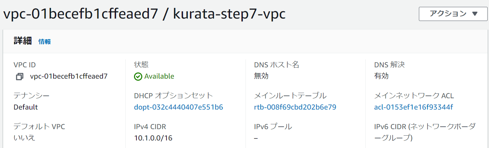

### サブネット
Name/CIDR 確認
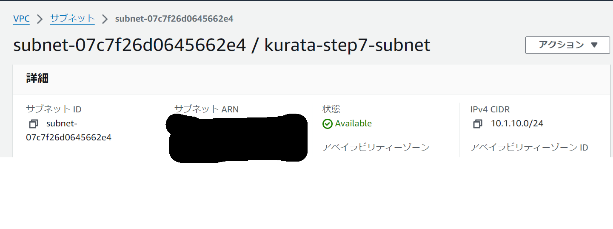

### app = front のとき

#### EC2
Name 確認
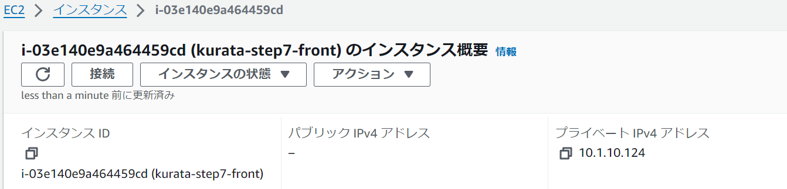

AMI 確認
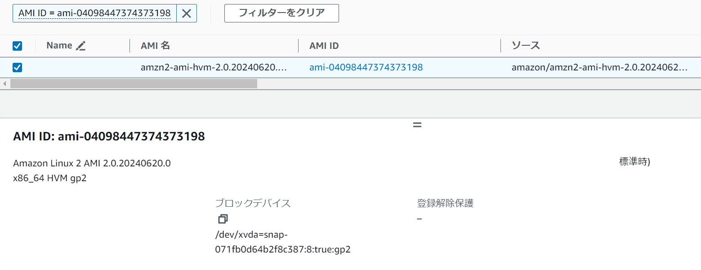

紐づくサブネット確認
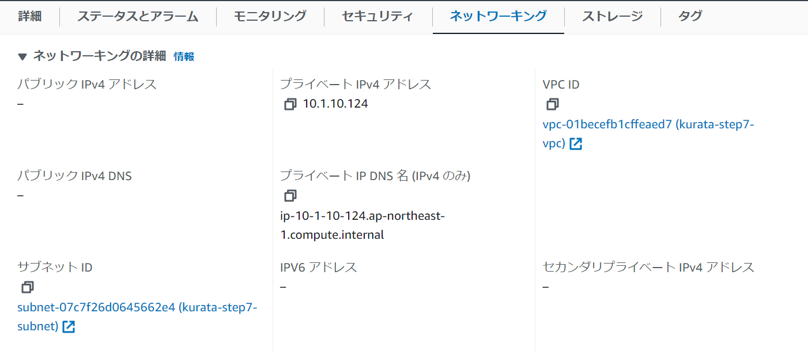

紐づくセキュリティグループ確認
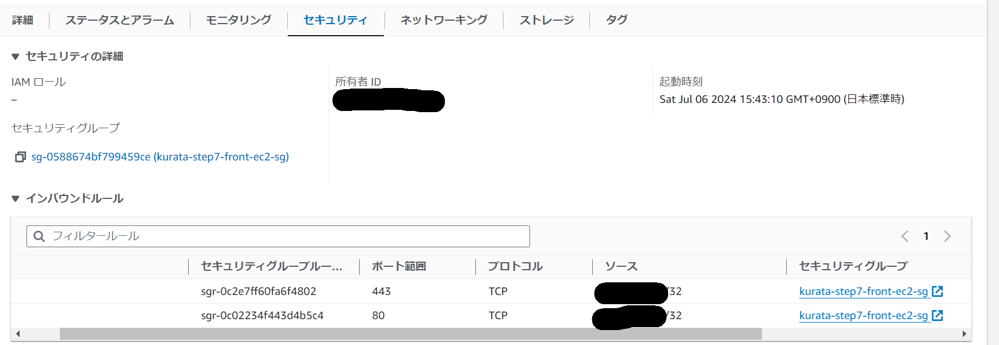

デバイス暗号化確認
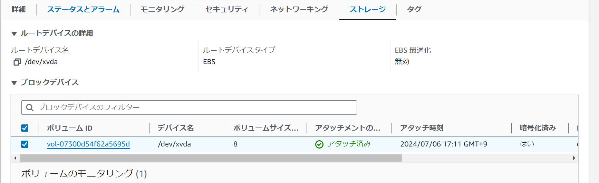

#### S3（なし）
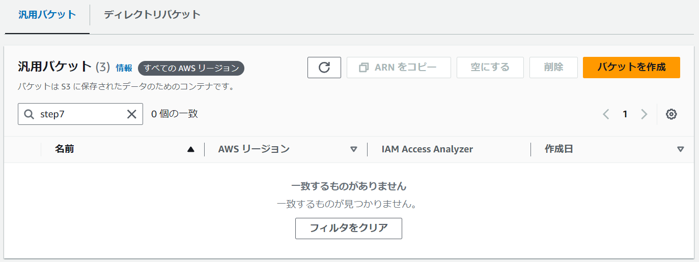

### app = back のとき

#### EC2
Name 確認
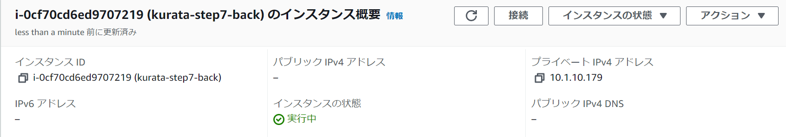

紐づくサブネット確認
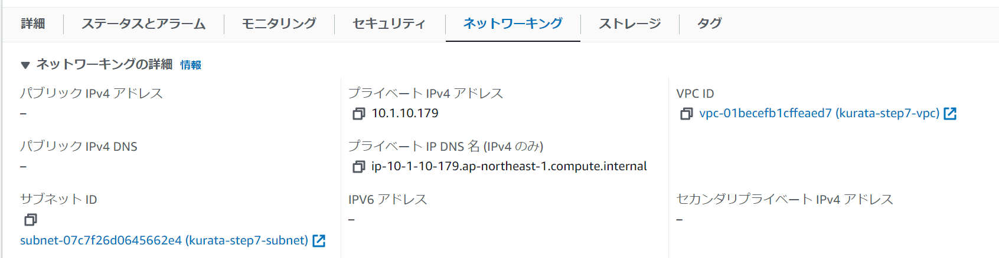

紐づくセキュリティグループ確認
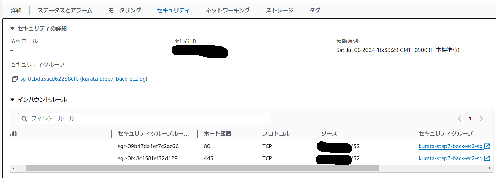

デバイス暗号化なし確認
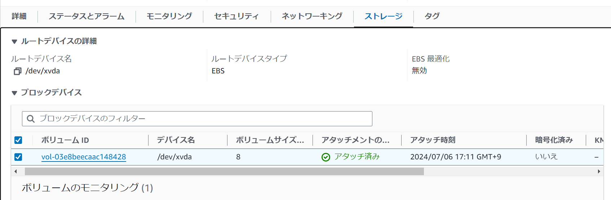

#### S3（あり）
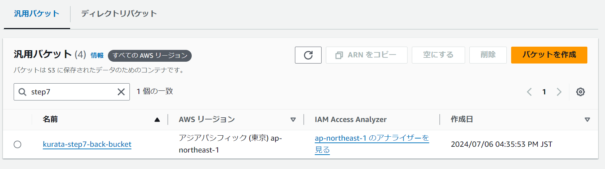
